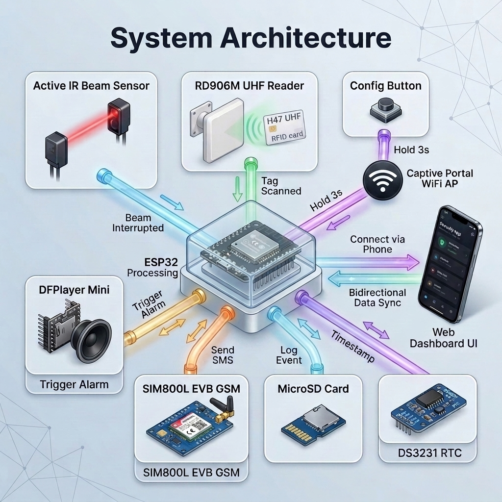
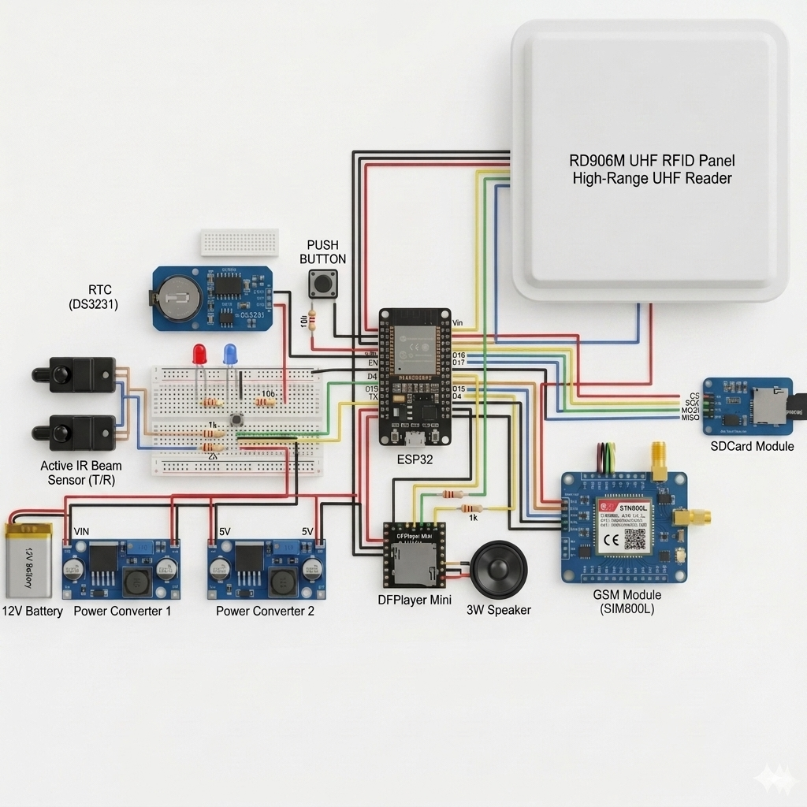
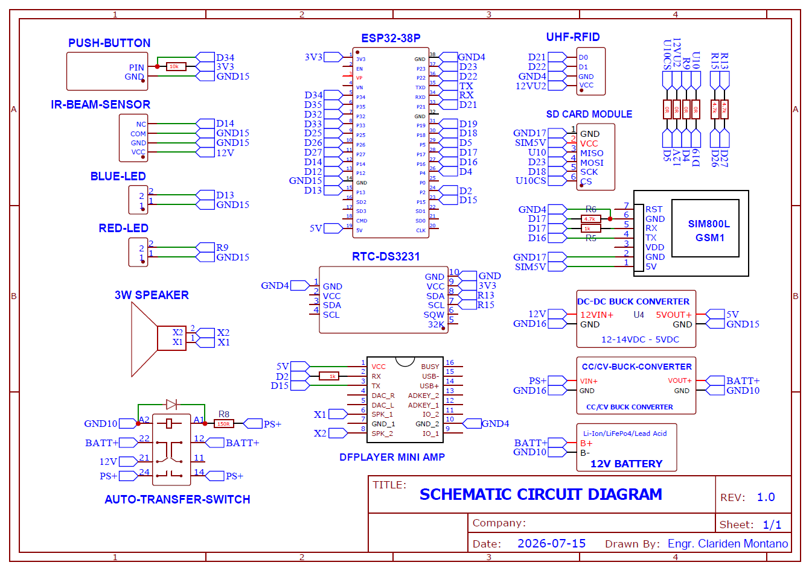

  
  <h1>ESP32 RFID Anti-Wall-Jumping System (Student Version)</h1>
  
<b>A fun, multi-sensor security project for learning hardware integration!</b>

  
  
  
  

---

## 🎮 Live Interactive Simulator (Run in Browser)

Want to see how the system works without touching any hardware? You can test student RFID cards, break the IR beam, view the timing gauges, and hear the audio siren directly in your browser:

- **🚀 [Launch Interactive Simulator](https://raw.githack.com/mclards/RFIDBased-Alarm-System-Student/master/simulator.html)** *(Instant in-browser execution via GitHack CDN)*
- **🌐 [Alternative Mirror via HTMLPreview](https://htmlpreview.github.io/?https://github.com/mclards/RFIDBased-Alarm-System-Student/blob/master/simulator.html)**
- **💻 Offline Mode:** Clone this repository and double-click [`simulator.html`](./simulator.html) to open in Google Chrome, Microsoft Edge, or Firefox.

---

## 📌 Overview

The **ESP32 RFID Anti-Wall-Jumping System** is a cool, real-time security project designed to detect when someone tries to climb over a wall and respond instantly! It uses an Infrared (IR) Beam to detect movement, a long-range UHF RFID reader to recognize authorized student IDs, a DFPlayer Mini to play voice alarms, and a SIM800L module to send text messages (SMS) to security personnel.

This **Student Version** of the repository contains the core code (`system_firmware.cpp`) fully commented to help you learn how to connect different hardware parts together, run multiple tasks at the same time using FreeRTOS, and communicate with cellular modules!

---

## ✨ What You Will Learn

- **🛡️ Intrusion Detection**: How to use an Active IR Sensor to create an invisible tripwire that detects when someone crosses a boundary.
- **📱 Sending Text Messages**: How to use a SIM800L module to send automatic SMS alerts to a phone number.
- **🔊 Playing Audio**: How to control a DFPlayer Mini to play custom MP3 voice alarms from an SD card.
- **🪪 Long Range RFID**: How to read UHF RFID tags from a distance (like toll booths or ID badges) using the Wiegand protocol.
- **💾 Saving Data**: How to save event logs and data onto a MicroSD card.
- **🕒 Keeping Time**: How to use a DS3231 Real-Time Clock (RTC) so your project always knows the exact date and time.

---

## 🏗️ System Architecture

---

## 🛠️ Hardware Stack

| Component | Hardware Model / Specification | Communication Interface | Operating Power | Primary Function |
| :--- | :--- | :--- | :--- | :--- |
| **Microcontroller** | ESP32-WROOM-32 (38-Pin Dev Board) | Dual-Core FreeRTOS / Wi-Fi / BT | 5V DC (VIN) | Central processing & state machine |
| **UHF RFID Reader** | RD906M Directional Panel Antenna | Wiegand 26 / 34 Protocol | 12V DC | Long-range RFID scanning (860–960 MHz) |
| **Perimeter Sensor** | Active Single-Beam IR Detector | Photoelectric NC Relay Loop | 12V DC | Infrared perimeter breach detection (Tripwire) |
| **Cellular Modem** | SIM800L EVB GSM / GPRS Module | Hardware UART2 (AT Commands) | 5V DC (2A Peak) | Dispatching instant SMS alerts to security |
| **Audio Synthesizer**| DFPlayer Mini MP3 Synthesizer | Hardware UART1 (Serial MP3) | 5V DC | Local siren and multi-track voice prompts |
| **Real-Time Clock** | DS3231 Precision RTC Module | I2C Bus (`0x68`) | 3.3V DC (CR2032) | Hardware timestamping for incident logging |
| **Data Storage** | MicroSD Card SPI Module | Hardware VSPI Bus | 5V DC | FAT32 logging (`eventlog.csv`, `students.csv`) |

### Realistic Component Layout

> [!NOTE]
> **Visual Reference Only:** The realistic component layout above is for visual purposes and aesthetic representation. For exact pin mapping and electrical connections, strictly follow the official 2D Schematic Circuit Diagram below.

---

## 📊 Bill of Materials & Procurement (BOM)

The complete component quotation, pricing breakdown, and labor calculations are documented in the official spreadsheet:

📄 **[Download Official Bill of Materials Spreadsheet (Grade10-Studds-V2.xlsx)](./Grade10-Studds-V2.xlsx)**

### V2 Hardware Migration & Component Summary

| Category | Component / Module | Purpose / Migration Details | Qty | Unit Price |
| :--- | :--- | :--- | :---: | :---: |
| **Major (V2 Active)** | **ESP32 DevKit (30-pin, WROOM-32)** | Main dual-core FreeRTOS processor & state machine | 1 | ₱390.00 |
| **Major (V2 Active)** | **RD906M Long-Range UHF RFID Reader** | 860–960 MHz Wiegand 26/34 reader *(Migrated from MFRC522)* | 1 | ₱12,630.00 |
| **Major (V2 Active)** | **Waterproof Active Dual-Beam IR Sensor** | Optical infrared tripwire detector *(Migrated from HC-SR04)* | 1 | ₱1,430.00 |
| **Major (V2 Active)** | **Alien H3 Long-Range UHF RFID Cards** | 860–960 MHz tracking cards *(Migrated from 13.56MHz tags)* | 10 | ₱120.00 |
| **Major (V2 Active)** | **SIM800L GSM/GPRS Module** | SMS alerts to security personnel | 1 | ₱390.00 |
| **Major (V2 Active)** | **DFPlayer Mini MP3 Player** | Spoken voice warnings & high-output alarm siren | 1 | ₱300.00 |
| **Major (V2 Active)** | **DS3231 Precision RTC Module** | Battery-backed hardware timestamping | 1 | ₱165.00 |
| **Major (V2 Active)** | **MicroSD Card Module (SPI)** | FAT32 master logs & student database storage | 1 | ₱75.00 |
| **Major (V2 Active)** | **12V/4A Power Supply & Charger** | Main power supply and Li-ion backup battery charger | 1 | ₱840.00 |
| **Major (V2 Active)** | **18650 Li-ion Batteries (3.7V)** | Uninterruptible backup power during outages | 4 | ₱110.00 |
| **Major (V2 Active)** | **Weatherproof ABS Enclosure** | Outdoor ABS wall-mountable protective casing | 1 | ₱380.00 |
| **Support Hardware** | Supporting Electronics & Wiring | Speakers, Buck Converters, PCBs, LEDs, Resistors, Jumper Wires | Lot | ₱1,270.00 |
| **Replaced (V1 Legacy)** | *MFRC522, Keychain Tags, HC-SR04* | *[Deprecated]* Replaced by UHF RFID & Active IR Sensors | Lot | *₱530.00* |
| **Procurement Total** | **Subtotal Materials + Shipping** | Materials (₱20,040.00) + Shipping Fees (₱720.00) | — | **₱20,760.00** |
| **Project Total** | **Materials + Labor (40 hrs)** | Materials & SF (₱20,760.00) + Labor & Prog. (₱10,000.00) | — | **₱30,760.00** |

---

## 🔌 Schematic Circuit Diagram

For full hardware wiring instructions and component mapping, please refer to the official wiring schematic:

📄 **[Download Official 2D Schematic Circuit Diagram (PDF)](./include/SchematicDiagram.pdf)**

---

## 🔌 Master Pinout Allocation (ESP32-38P)

All peripherals are assigned to specific GPIO pins to eliminate bus collisions (e.g., isolating Wiegand onto **GPIO 21/22** away from the MicroSD SPI bus on **GPIO 18/19**).

### Left Pin Rail (Sensors & System Inputs)

| GPIO Pin | Peripheral Signal | Connected Module | Voltage / Type | Notes & Logic |
| :--- | :--- | :--- | :--- | :--- |
| `GPIO 34` | **MODE BUTTON** | Tactile Pushbutton | 3.3V Input | Active LOW (Requires 10 kΩ pull-up to 3V3; Hold 3s to enter Config Mode) |
| `GPIO 35` | *(Unassigned)* | Reserved Input | — | High-impedance input available |
| `GPIO 32` | *(Unassigned)* | Reserved GPIO | — | Available for expansion |
| `GPIO 33` | *(Unassigned)* | Reserved GPIO | — | Available for expansion |
| `GPIO 25` | *(Unassigned)* | Reserved GPIO | — | Available for expansion |
| `GPIO 26` | **RTC SCL** | DS3231 RTC (`SCL`) | 3.3V I2C | Hardware I2C Clock (4.7 kΩ pull-up to 3V3) |
| `GPIO 27` | **RTC SDA** | DS3231 RTC (`SDA`) | 3.3V I2C | Hardware I2C Data (4.7 kΩ pull-up to 3V3) |
| `GPIO 14` | **IR BEAM SENSOR**| Active IR Receiver (`NC`) | 3.3V Input | Internal `INPUT_PULLUP` enabled (Fail-safe: HIGH = Beam Broken / Cut) |
| `GPIO 12` | *(Unassigned)* | Reserved GPIO | — | Boot pin MTDI (idles LOW) |
| `GND` | **MASTER GND** | Common Ground Bus | 0.0V Ground | **Tied to ALL component grounds** |
| `GPIO 13` | **STATUS LED** | Blue Indicator LED | 3.3V Output | 220 Ω resistor to GND |

### Right Pin Rail (Communications, SPI & Audio)

| GPIO Pin | Peripheral Signal | Connected Module | Voltage / Type | Notes & Logic |
| :--- | :--- | :--- | :--- | :--- |
| `GPIO 23` | **SPI MOSI** | MicroSD Module (`MOSI`) | 3.3V SPI | Dedicated Hardware VSPI Bus Master-Out |
| `GPIO 22` | **WIEGAND D1** | RD906M Reader (`D1`) | 3.3V/5V Input | Hardware Wiegand Data 1 Interrupt (No SPI conflict) |
| `GPIO 21` | **WIEGAND D0** | RD906M Reader (`D0`) | 3.3V/5V Input | Hardware Wiegand Data 0 Interrupt (No SPI conflict) |
| `GPIO 19` | **SPI MISO** | MicroSD Module (`MISO`) | 3.3V SPI | Dedicated Hardware VSPI Bus Master-In |
| `GPIO 18` | **SPI SCK** | MicroSD Module (`SCK`) | 3.3V SPI | Dedicated Hardware VSPI Bus Clock |
| `GPIO 5` | **SD CARD CS** | MicroSD Module (`CS`) | 3.3V Output | Hardware VSPI Chip Select |
| `GPIO 17` | **GSM TXD** | SIM800L EVB (`RXD`) | 3.3V UART2 | ESP32 `UART2 TX` → SIM800L `RX` |
| `GPIO 16` | **GSM RXD** | SIM800L EVB (`TXD`) | 3.3V UART2 | ESP32 `UART2 RX` ← SIM800L `TX` |
| `GPIO 4` | **ALARM LED** | Red Siren LED | 3.3V Output | 220 Ω resistor to GND (Active HIGH on Alarm trigger) |
| `GPIO 0` | *(Unused)* | System Boot Clock | — | Boot strapping pin (Left floating) |
| `GPIO 2` | **DFPLAYER TXD**| DFPlayer Mini (`RX`) | 3.3V UART1 | ESP32 `UART1 TX` → 1 kΩ series resistor → DFPlayer `RX` |
| `GPIO 15` | **DFPLAYER RXD**| DFPlayer Mini (`TX`) | 3.3V UART1 | ESP32 `UART1 RX` ← DFPlayer `TX` |

---

## 🚀 Installation for Actual Testing

When you are ready to test the system in a real environment (like a school courtyard or field), follow these steps carefully:

### Step 1: Align the Active IR Beam
The IR Beam has two parts: a **Transmitter (T)** and a **Receiver (R)**. 
1. Mount them on opposite sides of the wall/boundary you want to protect. 
2. Ensure they are perfectly aligned facing each other. (Most beam sensors have a small alignment LED inside that lights up when they are correctly pointed at each other).
3. Connect the signal wire from the Receiver to **GPIO 14** on the ESP32.

### Step 2: Mount the UHF RFID Panel
1. Mount the large white RD906M panel near the entrance of the boundary.
2. Angle the panel so it faces the direction people will be walking from.
3. Ensure it is firmly powered by the 12V battery and connect the Wiegand Data pins to **GPIO 21 (D0)** and **GPIO 22 (D1)**.

### Step 3: Insert the SIM Card & SD Card
1. Insert an active, unlocked Micro-SIM card into the SIM800L module. 
2. Insert a FAT32-formatted MicroSD card into the SD Card Module.
3. Insert your MicroSD card (with `.mp3` files) into the DFPlayer Mini.

### Step 4: Power Up
1. Connect your 12V battery.
2. The power converters will step the 12V down to 5V and 3.3V to safely power the ESP32 and modules.
3. Wait about 30 seconds for the SIM800L to connect to the cellular network (the blinking LED on the SIM module will slow down to once every 3 seconds when connected).

---

## 🎮 Standard Operations

Once the system is powered on and running `system_firmware.cpp`, it operates autonomously.

1. **Intrusion Event (Unauthorized Access)**: 
   - A person breaks the IR beam.
   - The DFPlayer instantly plays the alarm sound.
   - The SIM800L queues and sends an SMS alert to the registered security number.
   - The event is written to the SD Card.

### ⚙️ Optimal Web Dashboard Settings
If configuring this device via the built-in Wi-Fi Captive Portal (`http://192.168.4.1`), these default times are optimal for large campuses:
- **RFID Tag Retention / Memory:** `30000 ms` (30s)
- **SMS Grouping / Bucketing Window:** `10000 ms` (10s)
- **Alarm Duration:** `30000 ms` (30s)
- **Alarm Cooldown:** `60000 ms` (60s)
- **Sensor Breach Memory:** `5000 ms` (5s)

2. **Safe Passage Event (Authorized Access)**:
   - A person with an authorized UHF RFID tag approaches the panel.
   - The system registers the ID and flashes the Status LED.
   - The person walks through the IR Beam. 
   - The alarm **does NOT** trigger. The system logs a safe passage event.

---

## 🔧 Troubleshooting & Repair

If the system isn't acting as expected, consult this troubleshooting matrix before replacing components:

| Symptom | Probable Cause | Corrective Action |
| :--- | :--- | :--- |
| **System fails to send SMS** | SIM800L is underpowered or has no signal. | Check if the SIM800L LED is blinking fast (no signal) or slow (connected). Ensure the 5V power converter is outputting at least 2 Amps. Check SIM card balance. |
| **Alarm triggers randomly** | IR Beam misalignment or sunlight interference. | Realignment required. Ensure the receiver lens is shielded from direct, blinding sunlight. Check for wind blowing debris through the beam. |
| **No audio / DFPlayer silent** | SD card format issue or bad wiring. | Ensure SD card is FAT32 format. Audio files must be named `001.mp3`, `002.mp3`, etc. Check the 1k resistor on the TX line. |
| **RFID tags not reading** | Bad Wiegand connection or insufficient voltage. | The RD906M requires full 12V power. Check the D0 (GPIO 21) and D1 (GPIO 22) connections. |
| **SD Card fails to initialize** | SPI bus collision or loose jumper wire. | Check the CS pin on GPIO 5. Ensure the SD module receives full 5V (if it has a regulator) or 3.3V. |

### Component Replacement (Repair)
- If a sensor must be replaced, always **disconnect the 12V battery first**.
- **ESP32 Board**: If replacing the main board, you must re-flash `system_firmware.cpp` using PlatformIO before operation.
- **SIM800L Module**: Always swap the SIM card into the new module while the system is powered off to prevent shorting the SIM contacts.

---

## 📖 Official PDF Manual

You can also view all of these instructions (with extra setup configuration details) in our official formatted student guide:

### 👤 [Download the Complete System Manual (PDF)](./System_Manual.pdf)

---

## 🚀 How to Study This Code

The provided `system_firmware.cpp` file contains the complete code that makes all these hardware parts talk to the ESP32 microcontroller. You can open `system_firmware.pdf` for an easy-to-read, formatted version, or open the `.cpp` file in any text editor. 

**Pro Tip:** Pay special attention to how the code uses `FreeRTOS` to separate the sensor checking (`sensorTask`) from the SMS sending (`commTask`). This allows the ESP32 to do two things at once—so it never misses a tripped alarm even while it's waiting for a text message to send!

  <i>Developed using C++ and PlatformIO.</i>

