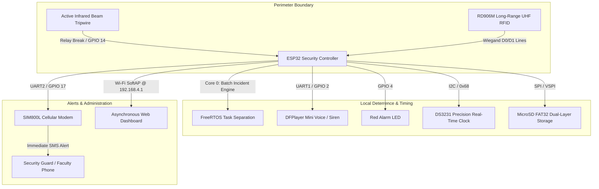
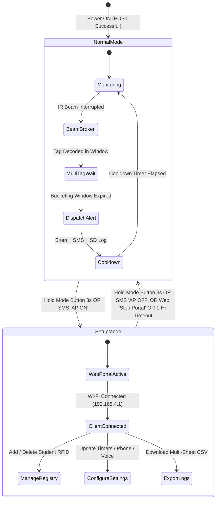

# ESP32 RFID Anti-Wall-Jumping System: Comprehensive Student & User Manual
**Advanced Multi-Sensor Security Solution for Campus Perimeter Protection & Automated Intrusion Detection**

---

## 📌 1. System Overview

The **ESP32 RFID Anti-Wall-Jumping System** is an intelligent, real-time perimeter security solution engineered to prevent, detect, identify, and log unauthorized boundary crossings (such as fence climbing or wall jumping) across campus perimeters.

Traditional perimeter alarms only sound a generic siren when a tripwire is tripped. This system bridges physical security and institutional student accountability by combining **Active Infrared (IR) Beam Tripwire Detection** with **Ultra-High Frequency (UHF 860–960 MHz) Wiegand RFID Identification**, **Cellular GSM (SIM800L) Instant SMS Alerting**, **DFPlayer Mini Voice Prompts & Sirens**, **FAT32 MicroSD Event Logging**, and an onboard **Asynchronous Wi-Fi Captive Portal Web Dashboard**.



---

## ✨ 2. Key Features

- 🛡️ **Fail-Safe Active Infrared Perimeter Detection:** Uses an industrial Active Single-Beam Photoelectric Detector with a Normally Closed (`NC`) loop. A beam break or wire cut immediately triggers hardware interrupt latching.
- 🪪 **Long-Range UHF RFID Identification (Wiegand 26/34):** Detects RD906M directional UHF cards from 1 to 6 meters away, reading student IDs even when concealed in pockets or backpacks during a crossing.
- 👥 **Multi-Suspect Incident Aggregation (Bucketing):** Collects multiple students jumping together into a single structured incident report, eliminating duplicate sirens and redundant SMS charges.
- 📱 **Automated Cellular SMS Alerts:** Dispatches detailed incident reports containing Student Names, Official Student ID Numbers, Assigned Wall Label, and Exact Physical Location within 3–5 seconds.
- 🔊 **Localized Audio Deterrence & Voice Warnings:** DFPlayer Mini broadcasts configurable high-decibel sirens or natural voice warnings (e.g., *"Warning: You are in a restricted zone. Please return to class."*).
- 💾 **Dual-Layer MicroSD FAT32 Storage:** Maintains a chronological Master Security Log (`/eventlog.csv`), individual Student Incident Ledgers (`/logs/<tagID>.csv`), and a Student Database (`/students.csv`).
- 🕒 **Hardware Timestamping (DS3231 RTC):** Precision battery-backed Real-Time Clock provides exact timestamps for forensic log analysis even across power outages.
- 🌐 **Embedded Wi-Fi Captive Portal Web Dashboard:** Full browser-based user interface served directly by the ESP32 for student enrollment, threshold tuning, audio testing, live sensor monitoring, and CSV report downloads without software installation.
- 🔒 **Resilient FreeRTOS Multi-Core Architecture:** Core 0 executes microsecond-level sensor polling and RFID decoding; Core 1 independently services cellular AT commands and asynchronous HTTP web clients.

<div class="page-break"></div>

---

## 🛠️ 3. Hardware Architecture & Electrical Connections

### 3.1 Hardware Component Master Table

| Component | Model / Specification | Interface Protocol | Operating Voltage | Primary Role |
| :--- | :--- | :--- | :--- | :--- |
| **Microcontroller** | ESP32-WROOM-32 (38-Pin) | Dual-Core 240 MHz FreeRTOS | 5V DC (VIN) | Core state machine, Wiegand parsing, and HTTP server |
| **UHF RFID Reader** | RD906M Directional Panel | Wiegand 26 / 34 (`D0`, `D1`) | 12V DC (External) | Long-range 860–960 MHz RFID tag interrogation |
| **Perimeter Sensor** | Active Single-Beam IR Detector | Photoelectric Relay (`NC`/`COM`)| 12V DC (External) | Optical tripwire boundary breach detection |
| **Cellular Modem** | SIM800L EVB GSM/GPRS Module | Hardware UART2 (`TX2`/`RX2`) | 5V DC (2A Peak Buck) | SMS dispatch and sender-validated remote commands |
| **Audio Synthesizer**| DFPlayer Mini MP3 Player | Hardware UART1 (`TX1`/`RX1`) | 5V DC | High-output siren and custom voice audio playback |
| **Real-Time Clock** | DS3231 Precision RTC | I2C Bus (`0x68`, `SDA`/`SCL`) | 3.3V DC (ESP32 3V3) | Hardware timestamping for event logs and SMS |
| **Data Storage** | MicroSD SPI Card Reader | Dedicated Hardware VSPI Bus | 5V DC | FAT32 master logs, student records, and system backups |
| **Visual Indicators**| 5mm LEDs (Red Alarm / Blue Status)| Direct GPIO Drive | 3.3V DC via 220 Ω | Real-time system state and alarm annunciation |
| **User Pushbutton** | Momentary Pushbutton | Active-LOW Input | 3.3V DC (10 kΩ Pullup) | Manual toggle between Guarding and Setup Mode |

---

### 3.2 Visual Hardware Layout Reference

> [!NOTE]
> The realistic component layout below provides visual guidance for breadboard or prototyping placement. For exact wiring and electrical safety, follow the schematic pinout table.


<div class="page-break"></div>

---

### 3.3 Schematic Circuit Diagram

For full circuit schematics, trace routing, and resistor pull-up values, refer to the official wiring schematic:


---

### 3.4 ESP32-38P Pin Allocation & Electrical Guidelines

```text
LEFT SIDE (Pin 1 → 19)                    RIGHT SIDE (Pin 38 → 20)
──────────────────────────────────────────────────────────────────
3V3     ── 3.3V Power Rail (RTC/Pullups)  GND     ── Common Ground Bus
EN      ── Reset Button                   GPIO23  ── SPI MOSI (SD Card)
GPIO36  ── (Unassigned / Input Only)      GPIO22  ── WIEGAND DATA1 (RD906M) *
GPIO39  ── (Unassigned / Input Only)      GPIO21  ── WIEGAND DATA0 (RD906M) *
GPIO34  ── MODE PUSHBUTTON (10k Pullup)   GPIO19  ── SPI MISO (SD Card)
GPIO35  ── (Unassigned / Input Only)      GPIO18  ── SPI SCK (SD Card)
GPIO32  ── (Unassigned)                   GPIO5   ── SPI CS (SD Card)
GPIO33  ── (Unassigned)                   GPIO17  ── SIM800L TXD (UART2 TX)
GPIO25  ── (Unassigned)                   GPIO16  ── SIM800L RXD (UART2 RX)
GPIO26  ── RTC SCL (I2C Clock - 4.7k)     GPIO4   ── RED ALARM LED (220 Ω)
GPIO27  ── RTC SDA (I2C Data - 4.7k)      GPIO0   ── Boot Strapping (Unused)
GPIO14  ── IR BEAM RELAY (INPUT_PULLUP)   GPIO2   ── DFPlayer Mini RX (1k Ω)
GPIO12  ── (Unassigned)                   GPIO15  ── DFPlayer Mini TX
GND     ── Common Ground Bus              GPIO8   ── Internal Flash (Do Not Connect)
GPIO13  ── BLUE STATUS LED (220 Ω)        GPIO7   ── Internal Flash (Do Not Connect)
GPIO9   ── Internal Flash (Do Not Connect)GPIO6   ── Internal Flash (Do Not Connect)
GPIO10  ── Internal Flash (Do Not Connect)GPIO11  ── Internal Flash (Do Not Connect)
GPIO11  ── Internal Flash (Do Not Connect)5V(VIN) ── 5V DC Regulated Power In
GND     ── Common Ground Bus              GND     ── Common Ground Bus
```

> [!CAUTION]
> **Wiegand Voltage Protection (GPIO 21 & GPIO 22):**  
> ESP32 inputs are **NOT 5V tolerant**. If the RD906M UHF reader outputs 5V logic pulses on D0/D1, you **must** use a 5V-to-3.3V bidirectional level shifter or open-collector transistors. Connecting 5V directly to GPIO 21 or 22 will permanently damage the microcontroller.

> [!CAUTION]
> **SIM800L GSM Power Isolation:**  
> The SIM800L module draws up to **2.0 Amperes peak current** during cellular radio bursts. Never attempt to power the SIM800L from the ESP32 `3V3` or `5V/VIN` pins. Always use a dedicated 5V 3A step-down (buck) converter with a shared common ground.

<div class="page-break"></div>

---

## 🎮 4. System Operations, Modes & State Machine

The firmware executes a dual-state machine transitioning between **Normal Guarding Mode** and **Setup / Configuration Mode**.



### 4.1 Normal Mode (Guarding)
- **Blue Status LED:** Solid **ON**.
- **Execution Flow:** Core 0 continuously checks the IR beam interrupt flag and reads Wiegand data packets.
- **Incident Alarm Sequence:**
  1. The IR beam is broken (rising edge latched on GPIO 14).
  2. The DFPlayer Mini immediately triggers the configured high-decibel MP3 voice or siren track.
  3. The Red Alarm LED (GPIO 4) turns on.
  4. The system opens a **Bucketing Window** to gather all unique UHF RFID tags scanned before or during the breach.
  5. The incident is committed to the SD Card master log (`/eventlog.csv`) and individual student files (`/logs/<tagID>.csv`).
  6. Core 1 formats the SMS alert and dispatches it through the SIM800L modem to the registered emergency phone number.
  7. The system enters **Cooldown** to prevent repetitive SMS spam and acoustic feedback.

### 4.2 Setup Mode (Web Configuration Portal)
- **Blue Status LED:** **Blinks Fast** (400ms cycle).
- **Execution Flow:** Intrusion tripwire monitoring is temporarily suspended to allow administrators to safely inspect the site. The ESP32 activates its Wi-Fi Access Point (`AntiWallJump-Setup`) and launches the HTTP Captive Portal at `http://192.168.4.1`.
- **How to Enter:** Press and hold the physical Mode Button (GPIO 34) for 3 seconds, or send the SMS command `AP ON`.
- **How to Exit:** Hold the Mode Button for 3 seconds, send `AP OFF`, click **"Stop Portal"** on the web dashboard, or allow the 1-hour idle timeout to expire.

### 4.3 Remote SMS Control Commands
Authorized personnel can control the unit remotely by sending SMS commands to the SIM800L phone number:

| SMS Command | Security Permission | System Action |
| :--- | :--- | :--- |
| `AP ON` | Guard Phone (or Anyone if Number Lock OFF) | Activates Wi-Fi Access Point & Captive Portal |
| `AP OFF` | Guard Phone (or Anyone if Number Lock OFF) | Deactivates Wi-Fi AP & re-arms perimeter security |
| `LOCK DEVICE` | **Guard Phone Only** (Strict) | Remotely locks the portal and pauses monitoring |
| `UNLOCK DEVICE` | **Guard Phone Only** (Strict) | Removes the administrative lock |
| `RESTORE FACTORY SETTINGS` | **Guard Phone Only** (Strict) | Erases all config, students, and logs; reboots system |

> [!NOTE]
> All SMS commands are case-insensitive and utilize a ±300-second timestamp validation window against the DS3231 RTC to prevent SMS replay attacks.

<div class="page-break"></div>

---

## 🌐 5. Web Dashboard & Configuration Guide (Complete Field Reference)

The built-in Asynchronous Web Portal allows full administrative control over Wi-Fi without installing specialized software.

### 5.1 Connecting to the Web Portal
1. Put the device into **Setup Mode** (Blue LED blinking fast).
2. Connect your smartphone, tablet, or laptop to the Wi-Fi network:
   - **Wi-Fi SSID:** `AntiWallJump-Setup` (Default)
   - **Wi-Fi Password:** `configure123` (Default)
3. The browser will automatically open the login page via Captive Portal detection. If it does not, open your browser and navigate to `http://192.168.4.1`.
4. Enter the Admin Password (default: `admin`) and click **Log In**.

---

### 5.2 Top Navigation & Header Status Bar

The persistent header provides real-time diagnostic badges and one-touch system actions:

- **Live Clock Badge (`#hdrTime`):** Shows the current local time derived from the DS3231 RTC.
- **Node Identifier (`#hdrNode`):** Displays the assigned system identifier name.
- **SIM Status (`#hdrSimStatus`):** Displays cellular network registration (`Registered` in green, or `Searching` / `No SIM` in red).
- **SIM Phone Number (`#hdrSimNumber`):** Displays the phone number of the installed SIM card.
- **Sync Clock Button (🔄):** One-click synchronization that updates the hardware RTC to match your phone or computer's exact local time.
- **Theme Toggle (🌓):** Switches between high-contrast Dark Mode and crisp Light Mode (preference saved in browser storage).
- **Logout Button (🚪):** Clears the admin session token and returns to the login screen.
- **Stop Portal Button (⚡):** Immediately terminates the Wi-Fi Access Point, re-arms the infrared tripwire, and returns the system to Normal Guarding Mode.

<div class="page-break"></div>

---

### 5.3 Tab 1: Dashboard (`#page-dashboard`)

The Dashboard provides a comprehensive overview of hardware health, live sensor feeds, and active security status.

#### Dashboard Stat Cards & Tooltip Explanations

| UI Element | Data Source | Field Tooltip / Explanation | Purpose & Impact |
| :--- | :--- | :--- | :--- |
| **Security Status Banner** | `/api/rtc` | *Live state of the perimeter tripwire.* | Displays **`SYSTEM SECURED`** (Green) during normal operations, or **`SECURITY COMPROMISED - ALARM ACTIVE`** (Pulsing Red) when an active breach is underway. |
| **Node ID** | `sysConfig.nodeID` | *"The unique name and software version of this alarm unit."* | Identifies the physical device in multi-unit campus deployments. |
| **Storage Media** | SD Card Driver | *"Shows if the memory card is working to save logs."* | Confirms if the FAT32 MicroSD card is mounted and accepting write operations. |
| **Hardware Clock** | DS3231 RTC | *"The current time, automatically updated over Wi-Fi."* | Displays the precision hardware time used for all audit logging. |
| **Alert Recipient & Role** | `guardPhone` | *"The phone number that will receive the text messages."* | Verifies the active SMS destination and contact role (Guard / Teacher). |
| **Sensor Config** | System Core | *"The physical setup of the infrared beam sensors."* | Confirms active sensor topology (Active Single-Beam IR Detector). |
| **Audio Module** | DFPlayer Driver | *"Shows if the alarm speaker is working properly."* | Confirms hardware serial communication with the DFPlayer Mini MP3 decoder. |
| **Zone Assigned** | `wallLabel` | *"The name of the wall or fence being protected."* | Displays the shorthand perimeter sector name included in SMS alerts. |
| **Exact Location** | `locationDesc` | *"The specific location description for the guards."* | Full geographic landmark description to direct security response teams. |
| **Sensor Status** | Real-time GPIO | *"Shows if the jump sensors and ID scanner are active."* | Live dual status indicator showing: <br>• **Port 14 (IR Beam):** `CLEAR` (Green) or `TRIGGERED` (Red)<br>• **D0/D1 (RFID):** `STANDBY` or `READING...` (Blue) |
| **Test SMS Button** | `/api/sms/test` | *Dispatches an instant cellular test alert.* | Verifies SIM balance, antenna signal, and SMS delivery to the configured recipient. |

<div class="page-break"></div>

---

### 5.4 Tab 2: Settings (`#page-settings`)

The Settings view is partitioned into three dedicated configuration sections with real-time unsaved change tracking (buttons turn orange with an asterisk `*` when modified).

---

#### 5.4.1 Sub-Tab: Device Config (`#cfg-device`)

| Input Field | ID / Parameter | Default | Range / Format | Tooltip / Detailed Explanation |
| :--- | :--- | :--- | :--- | :--- |
| **Device ID** | `#cfgNodeID`<br>`nodeID` | `NODE_01` | 1–31 Characters | **Tooltip:** *"Name of this alarm device (e.g., Gate 1)."*<br>**Explanation:** Unique alphanumeric name for this ESP32 unit. Displayed on the dashboard header and diagnostic logs. |
| **Wall Label** | `#cfgWallLabel`<br>`wallLabel` | `Wall Section` | 1–31 Characters | **Tooltip:** *"Name of the physical wall or boundary being protected (e.g., Section A)."*<br>**Explanation:** Primary location headline inserted into the SMS alert message body. |
| **Location Description** | `#cfgLocationDesc`<br>`locationDesc` | `Campus Perimeter` | 1–127 Characters | **Tooltip:** *"A clear description of where this wall is located to help guards find it."*<br>**Explanation:** Detailed physical description (e.g., *"Behind Chemistry Lab near East Gate"*) to guide security officers directly to the breach location. |
| **Emergency Contact Number** | `#cfgPhone`<br>`guardPhone` | `+639XXXXXXXXX` | E.164 or Local Format (Max 31 chars) | **Tooltip:** *"The phone number that will receive the text message alerts."*<br>**Explanation:** Mobile number to receive intrusion SMS alerts. Automatically validates and formats numbers starting with `+639...`, `09...`, or `9...`. |
| **Number Lock** | `#cfgNumberLock`<br>`numberLock` | `OFF` (0) | Boolean Toggle (`0` / `1`) | **Tooltip:** *"If checked, only the emergency phone number is allowed to send text commands to the alarm."*<br>**Explanation:** Security whitelist feature. When enabled, incoming SMS commands (`AP ON`, `AP OFF`) are rejected unless sent from the configured `guardPhone`. |
| **Recipient Role** | `#cfgRecipientRole`<br>`recipientRole` | `Guard` | `Guard` / `Teacher` | **Tooltip:** *"Choose the recipient role for SMS alerts (e.g., Guard or Teacher)."*<br>**Explanation:** Customizes SMS alert headers (`[CAMPUS ALERT - SECURITY]` for Guard vs `[CAMPUS ALERT - FACULTY]` for Teacher). |

<div class="page-break"></div>

---

#### 5.4.2 Sub-Tab: Alert Triggers & Timers (`#cfg-alert`)

This section controls the FreeRTOS timing window engine, siren durations, and audio synthesizer tracks.

| Input Field | ID / Parameter | Default | Valid Range | Tooltip / Detailed Explanation |
| :--- | :--- | :--- | :--- | :--- |
| **Alarm Duration** | `#cfgDuration`<br>`alarmDuration` | `30000 ms` | 1,000–300,000 ms (1s–5min) | **Tooltip:** *"How long the alarm siren will sound when someone jumps the wall. (e.g., 30000 = 30 seconds)."*<br>**Explanation:** Controls the active runtime of the DFPlayer Mini siren and Red Alarm LED during a breach. |
| **Cooldown Time** | `#cfgCooldown`<br>`cooldown` | `60000 ms` | 5,000–600,000 ms (5s–10min) | **Tooltip:** *"Wait time after an alarm before the system can trigger again. Prevents SMS and siren spam. (e.g., 60000 = 60 seconds)."*<br>**Explanation:** Enforces a mandatory refractory quiet period after an alarm, preventing runaway SMS charges if students linger near the beam. |
| **Breach Memory** | `#cfgBreachMemoryMs`<br>`breachMemoryMs` | `5000 ms` | 1,000–60,000 ms (1s–60s) | **Tooltip:** *"How long the system holds a motion sensor trigger before clearing it. (e.g., 5000 = 5 seconds)."*<br>**Explanation:** Duration an IR beam interruption pulse remains active in memory waiting to pair with an RFID card read. |
| **RFID Memory** | `#cfgTagMemoryMs`<br>`tagMemoryMs` | `30000 ms` | 1,000–600,000 ms (1s–10min) | **Tooltip:** *"Time window a student has to cross the beam after scanning their ID. If they cross within this time, they are caught. (e.g., 30000 = 30 seconds)."*<br>**Explanation:** How long a decoded UHF RFID tag remains buffered in the active suspect pool. If the student trips the IR beam within this window, their identity is attached to the incident. |
| **Bucketing Window** | `#cfgBucketWindowMs`<br>`bucketWindowMs` | `10000 ms` | 1,000–60,000 ms (1s–60s) | **Tooltip:** *"Time window after an alarm triggers to group other jumping students into the same SMS alert. (e.g., 10000 = 10 seconds)."*<br>**Explanation:** Post-alarm aggregation window. If a group jumps the wall together, newly decoded unique cards are added to the same incident report and SMS before dispatching. |
| **Unsent SMS Expiry** | `#cfgSmsAlertExpiryMinutes`<br>`smsAlertExpiryMs` | `60 min` | 1–1,440 min (1min–24hr) | **Tooltip:** *"Failed SMS alerts are retried until this time limit is reached. Valid range: 1 to 1440 minutes."*<br>**Explanation:** Maximum time queued SMS alerts remain in the modem queue during cellular signal blackouts before being discarded. |
| **Beam Alert Delay** | `#cfgPersistentBeamAlertMinutes`<br>`persistentBeamAlertMs` | `15 min` | 1–1,440 min (1min–24hr) | **Tooltip:** *"Send one SMS when the IR beam stays broken for this long. Another SMS is allowed only after the beam recovers. Valid range: 1 to 1440 minutes."*<br>**Explanation:** Dispatches a specialized sabotage warning SMS if the infrared beam is continuously blocked (by branches, vandalism, or tape) for longer than this limit. |
| **Alarm Voice Track** | `#cfgAlarmVoice`<br>`alarmVoice` | `Track 1` | Tracks 1 to 8 | **Explanation:** Selects the active MP3 audio file played from the DFPlayer Mini SD card (`/mp3/0001.mp3` through `0008.mp3`). Includes Play/Stop audio audition buttons. |
| **System Voice Prompts** | `/api/audio/play` | — | Tracks 12, 13, 14 | **Explanation:** Diagnostic buttons to test voice prompts: `Save Conf` (Track 12), `Load Avail` (Track 13), and `No Load` (Track 14). |

<div class="page-break"></div>

---

#### 5.4.3 Sub-Tab: System Security & Network (`#cfg-security`)

Controls Wi-Fi hotspot parameters, administrative passwords, and system recovery tools.

| Input Field | ID / Parameter | Default | Constraints | Tooltip / Detailed Explanation |
| :--- | :--- | :--- | :--- | :--- |
| **New AP Name (SSID)** | `#cfgApSSID`<br>`apSSID` | `AntiWallJump-Setup` | 1–31 Characters | **Tooltip:** *"The new Wi-Fi name this alarm will broadcast."*<br>**Explanation:** Customizes the SoftAP Wi-Fi network name broadcast during Setup Mode. |
| **New AP Password** | `#cfgApPassword`<br>`apPassword` | `configure123` | 8–63 Characters (WPA2) | **Tooltip:** *"The new password to connect to this alarm's Wi-Fi."*<br>**Explanation:** WPA2 passphrase required to join the setup Wi-Fi network. Must be at least 8 characters. |
| **Confirm AP Password** | `#cfgApPasswordConfirm` | — | Must match AP Password | **Tooltip:** *"Type the new Wi-Fi password again to confirm."*<br>**Explanation:** Prevents accidental lockouts caused by typing errors. |
| **Device IP Address** | `#cfgDeviceIP`<br>`deviceIP` | `192.168.4.1` | Valid IPv4 Format | **Tooltip:** *"The web address used to access this page. Leave as default unless needed."*<br>**Explanation:** Gateway IP address of the ESP32 Access Point. |
| **New Admin Password** | `#cfgAdminPassword`<br>`adminPassword` | `admin` | Min 4 Characters | **Tooltip:** *"The new password to log into this webpage."*<br>**Explanation:** Sets the authentication password required to log into the web portal. |
| **Confirm Admin Password**| `#cfgAdminPasswordConfirm` | — | Must match Admin Pass | **Tooltip:** *"Type the new webpage password again to confirm."*<br>**Explanation:** Password validation confirmation. |
| **Reboot Hardware** | `/api/reboot` | — | Safe ESP32 Restart | **Explanation:** Performs a clean software restart of the ESP32 microcontroller without erasing any stored settings or logs. |
| **Factory Reset** | `/api/factory_reset` | — | Requires typing `CONFIRM` | **Explanation:** Opens a modal requiring the user to type `CONFIRM`. Completely wipes EEPROM, deletes SD card registries and logs, restores factory defaults, and reboots. |

<div class="page-break"></div>

---

### 5.5 Tab 3: Student Registry (`#page-registry`)

The Student Registry manages authorized student cards, links UHF RFID tags to institutional records, and provides access to individual student violation histories.

#### 5.5.1 Enrolling a Student Card (Step-by-Step)
1. Navigate to the **Registry** tab.
2. Click **Scan Card** (`#btnScan`). The scanner enters a 30-second live listening mode with an animated spinner.
3. Present the UHF card within range of the RD906M antenna.
   - **Single Card Success:** The unique hex ID auto-populates in the **RFID Tag ID** field (`#regTagID`).
   - **Card Collision Detected:** If multiple cards are in the field simultaneously, the portal alerts: *"⚠️ Multiple cards detected! Clear the area and scan only ONE card."*
   - **Duplicate Warning:** If the card is already registered, the portal warns who the card is currently assigned to.
4. Enter the student's **Complete Name** (e.g., `Juan Dela Cruz`).
   - **Tooltip:** *"The full name of the student or staff member."*
5. Enter the **Official Student ID** (e.g., `2026-0413`).
   - **Tooltip:** *"The official student ID number."*
6. Click **Register Student**. The record is saved to the MicroSD card (`/students.csv`).

#### 5.5.2 Student Incident History Modal (`#history-modal`)
- In the Registered Students table, clicking any student's blue **Official Student ID** link opens their dedicated incident history modal.
- It parses `/logs/<tagID>.csv` and displays an infraction audit trail with **Timestamp**, **Assigned Wall**, and **Severity** rating.

<div class="page-break"></div>

---

### 5.6 Tab 4: Records & Data Logging (`#page-logs`)

The Records view provides access to chronological intrusion logs and master CSV data exports.

#### 5.6.1 Exporting Multi-Sheet CSV Logs (`Campus_Security_Logs.csv`)
1. Click **"Download Logs"** (`#downloadLogs`).
2. The browser downloads a master CSV file formatted with distinct spreadsheet sections:
   - **Section 1: Master Chronological Log** (`Timestamp`, `Incident Type`, `Wall`, `Suspect Count`, `Suspect Names & IDs`).
   - **Section 2: Student Registry Roster** (`Tag ID`, `Name`, `Student ID`, `Infraction Count`).
   - **Section 3: Per-Student Incident History Breakdowns** (Individual logs for every registered student).
3. The downloaded file can be directly opened in Microsoft Excel, Google Sheets, or Apple Numbers.

> [!TIP]
> **Mobile Browser Download Note:**  
> Some mobile operating systems block automatic file downloads within captive portal browser windows. If tapping "Download Logs" does not start a download on your phone, open your mobile browser (Chrome/Safari) and manually type `http://192.168.4.1` into the address bar to download.

---

## 🪪 6. Multi-Card Incident Bucketing & Timing Theory

A primary innovation of this system is its ability to handle group wall-jumping incidents without creating duplicate logs or sending multiple fragmented SMS alerts.

### 6.1 How the Timing Engine Works
1. **Pre-Breach Retention (RFID Memory = 30,000 ms):**  
   As students approach the wall, the RD906M reader detects their UHF tags. Each decoded tag is stored in `recentTags` (up to 20 unique IDs). The memory window resets after the *most recently decoded* card.
2. **Breach Event (Breach Memory = 5,000 ms):**  
   When a student climbs over the fence and breaks the IR beam, GPIO 14 latches the interrupt. The system immediately sounds the local siren and activates the Red LED.
3. **Post-Breach Aggregation (Bucketing Window = 10,000 ms):**  
   The system waits an additional 10 seconds. If accomplices jump immediately after the first student, their newly decoded unique RFID tags are added into the current incident bucket. Duplicate reads of the same card are ignored and do not reset the timer.
4. **Atomic Event Finalization:**  
   When the bucketing window expires, the system writes the incident to `/eventlog.csv`, updates student trigger counts, and queues a single consolidated SMS alert to security.

<div class="page-break"></div>

---

## 📱 7. SMS Alert Formats & Carrier Specifications

Alert messages are formatted with clean bullet points and character limits optimized for standard cellular SMS networks (160 characters per single GSM SMS, automatically splitting into multipart messages when necessary).

### 7.1 SMS Message Templates

#### Scenario A: Single Identified Student
```text
[CAMPUS ALERT - SECURITY]
ALERT: 1 Student(s) caught climbing over the North Wall!
Location: Behind Science Laboratory Building B
ID Numbers Detected:
- (2026-0413) JUAN DELA CRUZ
```

#### Scenario B: Group Detection (3 Students Jumping Together)
```text
[CAMPUS ALERT - SECURITY]
ALERT: 3 Student(s) caught climbing over the North Wall!
Location: Behind Science Laboratory Building B
ID Numbers Detected:
- (2026-0413) JUAN DELA CRUZ
- (2026-0889) MARIA CLARA
- (2025-0102) JOSE RIZAL
```

#### Scenario C: Unregistered Tag Detected (Stranger / Unenrolled Card)
```text
[CAMPUS ALERT - SECURITY]
ALERT: 1 Student(s) caught climbing over the North Wall!
Location: Behind Science Laboratory Building B
ID Numbers Detected:
- (9F0A1B2C) Unregistered
```

#### Scenario D: Unidentified Crossing (No RFID Tag Detected)
```text
[CAMPUS ALERT - SECURITY]
CRITICAL: Perimeter tripwire breach detected with NO RFID tag detected!
Wall: North Wall
Location: Behind Science Laboratory Building B
Time: 02:45:12 PM
Immediate guard dispatch required.
```

#### Scenario E: Persistent Beam Blockage / Sabotage Warning
```text
[CAMPUS ALERT - SECURITY]
WARNING: Perimeter IR beam has been continuously BLOCKED for 15 minutes!
Wall: North Wall
Location: Behind Science Laboratory Building B
Check sensor for obstruction, alignment issues, or intentional tampering.
```

<div class="page-break"></div>

---

## 🔧 8. Diagnostic Playbook & Maintenance

### 8.1 Power-On Self Test (POST)
When powered on, connect a USB cable and open the PlatformIO / Arduino Serial Monitor at **115200 baud** to verify startup diagnostics:

```text
[BOOT] ==========================================
[BOOT] ESP32 RFID Anti-Wall-Jumping System v2.0
[BOOT] FreeRTOS Core 0 (Sensors) & Core 1 (Comms)
[BOOT] ==========================================
[RTC] DS3231 Real-Time Clock initialized. Time: 2026-08-17 14:02:00
[SD] MicroSD Card initialized successfully (FAT32).
[DB] Student database loaded (14 registered cards).
[DFP] DFPlayer Mini MP3 Player ready on UART1.
[GSM] Initializing SIM800L modem on UART2...
[GSM] SIM800L Ready. Signal Quality: Good (CSQ 22).
[WIFI] SoftAP initialized: SSID 'AntiWallJump-Setup' (192.168.4.1)
[SYSTEM] Perimeter Guarding State Machine Active.
```

---

### 8.2 Troubleshooting Matrix

| Symptom | Probable Cause | Corrective Action |
| :--- | :--- | :--- |
| **Storage Media shows "Missing / Failed"** | MicroSD card not inserted, unformatted, or corrupted. | Format MicroSD card to **FAT32** on a PC. Ensure card is 32GB or smaller (FAT32 limitation). Check SPI CS (GPIO 5), MOSI (23), MISO (19), SCK (18) wiring. |
| **SIM Status shows "Searching" or "No SIM"** | Low modem voltage, missing SIM, or poor carrier coverage. | Verify 5V 3A buck converter is delivering at least 4.8V under load. Verify SIM card is inserted correctly with golden contacts facing PCB. Check SIM antenna connection. |
| **Audio Siren Silent or Popping** | Missing MP3 files, wrong folder structure, or loose speaker leads. | Ensure audio SD card has a folder named `/mp3/` containing `0001.mp3` through `0008.mp3`. Verify 1 kΩ series resistor is installed on ESP32 GPIO 2 → DFPlayer RX. |
| **RFID Tag Not Scanning** | Wiegand wiring reversed, reader unpowered, or voltage mismatch. | Verify RD906M reader is receiving 12V DC power. Swap Wiegand D0 (GPIO 21) and D1 (GPIO 22) lines. Verify level shifter is stepping down 5V pulses to 3.3V. |
| **IR Beam shows "TRIGGERED" constantly** | IR transmitter misaligned, optical path blocked, or wrong relay terminal. | Align IR emitter and receiver until internal alignment LED turns OFF. Ensure wire is connected to receiver `COM` and `NC` (Normally Closed), not `NO`. |
| **SMS Not Received during Alarm** | Out of cellular prepaid balance, wrong number format, or number lock active. | Click **"Test SMS"** on dashboard. Verify emergency number format is `+639XXXXXXXXX`. Check carrier load balance. |

---

### 8.3 Routine Maintenance Checklist (Quarterly)
- [ ] **Clean Optical Lenses:** Wipe dust, cobwebs, and moisture from the IR beam transmitter and receiver housings.
- [ ] **Check RTC Coin Battery:** Verify the CR2032 backup battery on the DS3231 RTC maintains time when main power is disconnected.
- [ ] **Backup SD Card Records:** Insert the MicroSD card into a computer or click "Download Logs" on the web portal to archive CSV security ledgers.
- [ ] **Test Audio Output:** Use the dashboard "Play Track" button to confirm speaker volume and clarity.
- [ ] **Verify Cellular Balance:** Dispatch a Test SMS to ensure the SIM card has sufficient balance and remains active on the carrier network.
